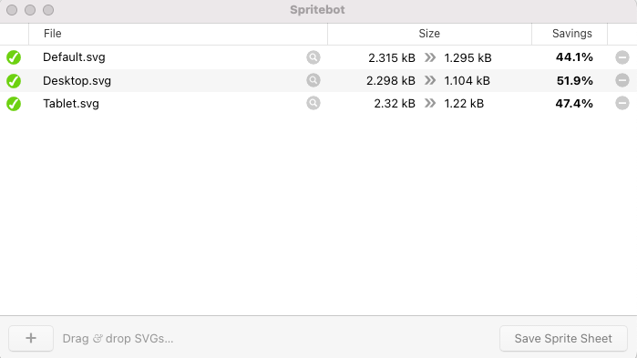

## sprite란?

sprite란 **여러 개의 이미지를 하나의 이미지로** 합쳐 관리하는 이미지를 말한다. 이미지를 사용하게 되면 웹 브라우저는 이미지를 다운받기 위해 서버에 이미지를 요청하는데 **이때 이미지가 많을 경우 서버에 이미지의 수 만큼 요청을 해야하기 때문에 웹 페이지의 로딩 시간이 길어지게 된다.**

이외에도 많은 이미지 파일을 관리하는 것이 아닌 sprite 이미지만을 관리하면 되므로 매우 간편해진다.

## svg sprite를 사용하게 된 계기

프로젝트 내 아이콘이 많이 사용되니 sprite 기법을 사용하기로 했고 png로 sprite를 만들었다. 만들면서 느낀 문제점은 아래와 같다.

- 반응형 웹을 구현하다보니 아이콘 관련 코드 또한 너무 길고 복잡해짐
- png로 아이콘을 만드니 확대/축소에 따른 화질 저하가 너무 심해짐
- sprite 특성상 sprite 이미지 내 해당 아이콘의 위치를 적어야하는 번거로움

아래 코드는 처음 png sprite를 썼을 때의 코드다.

```typescript
// svg sprite 적용 이전 코드
const StTab = styled(Link)`
  ${getFontStyle("ParagraphS")}
  text-decoration: none;
  color: ${getColor("--gray200")};
  display: flex;
  align-items: center;
  gap: ${rem(4)};
  @media (min-width: ${rem(768)}) {
    ${getFontStyle("ParagraphM")}
  }
  @media (min-width: ${rem(1920)}) {
    ${getFontStyle("ParagraphL")}
    gap: ${rem(10)};
  }
  &:hover {
    color: ${getColor("--white")};
    ${(props) =>
      props.icon &&
      css`
        &:: before {
          background-position: ${(props) =>
            props.icon === "live" ? "-98px -532px" : "-1270px -22px"};
          @media (min-width: ${rem(1920)}) {
            background-position: ${(props) =>
              props.icon === "live" ? "-136px -574px" : "-702px -179px"};
          }
        }
      `}
  }
  ${(props) =>
    props.icon &&
    css`
      &::before {
        background: url("/src/assets/sprites.png") no-repeat;
        background-position: ${(props) =>
          props.icon === "live" ? "-30px -532px" : "-569px -141px"};
        width: ${(props) => (props.icon === "live" ? "20px" : "65px")};
        height: ${(props) => (props.icon === "live" ? "17px" : "15px")};
        display: inline-block;
        content: "";
        @media (min-width: ${rem(1920)}) {
          background: url("/src/assets/sprites.png") no-repeat;
          background-position: ${(props) =>
            props.icon === "live" ? "-30px -574px" : "-570px -179px"};
          width: ${(props) => (props.icon === "live" ? "34px" : "111px")};
          height: ${(props) => (props.icon === "live" ? "27px" : "26px")};
        }
      }
    `};
`;
```

## svg sprite sheet 만들기

팀원들의 코드 리뷰에 따라 모든 아이콘들은 png에서 svg로 변경하기로 했다.
svg sprite sheet를 생성하는 방법은 아래 링크를 참고했다.

🔗https://a11y.gitbook.io/graphics-aria/svg-graphics/sprites

<br/>

### 1. Spritebot을 사용하여 svg 최적화 후 sprite-sheet 생성

아래 링크에서 `Spritebot`이라는 설치형 GUI svg sprite 생성기를 다운로드 받는다.

🔗https://github.com/thomasjbradley/spritebot#download

아래와 같이 sprite sheet에 포함할 svg 파일들을 Drag&Drop으로 넣어주면 자동으로 최적화가 된다.

<p align="center"></p>

<br/>

### 2. svg sprite 사용하기

파일을 이미지 폴더에 넣어준다. 파일을 열어보면 아래와 같이 `svg`안에 `symbol`로 이루어진 것을 볼 수 있다. 각 svg마다 `id`를 설정해줘야 한다. 이 `id`를 통해 sprite 파일 내의 svg들을 사용할 수 있게 된다.

```typescript
<svg xmlns="http://www.w3.org/2000/svg">
  <symbol id="cancel" viewBox="0 0 30 30">
    ...
  </symbol>
  <symbol id="banner-arrow" viewBox="0 0 30 30">
    ...
  </symbol>
  <symbol id="check" viewBox="0 0 70 70">
    ...
  </symbol>
</svg>
```

아래는 기본적인 svg 이미지 호출 방법이다. `<svg><use/></svg>`를 사용해 svg 심볼을 재사용하며, 필요할 경우 색상을 변경하거나 애니메이션을 적용하는 등 활용도가 높다고 한다. href에 파일 경로를 적고 뒤에 #id를 붙이면 svg를 불러올 수 있다.

```typescript
<svg>
  <use href="./이미지-폴더/sprite-sheet.svg#icon-pricetag" />
</svg>
```

<br/>

### 3. Svg 컴포넌트 만들기

svg sprite를 사용하다보니, 편하긴 편한데 매번 `<svg><use /></svg>`가 반복되는 것이 불편하다고 느껴졌다. 반복되는 코드를 줄이기 위해 Svg 컴포넌트를 만들었다.

```typescript
import styled, { css } from "styled-components/macro";
import { rem } from "@/theme/utils";

interface IStSvg {
  className?: string;
  desktopW?: number | string;
  desktopH?: number | string;
  tabletW?: number | string;
  tabletH?: number | string;
  width: number | string;
  height: number | string;
}

interface ISvgProps extends IStSvg {
  id: string;
}

const StSvg = styled.svg<IStSvg>`
  width: ${(props) =>
    isNaN(Number(props.width)) ? props.width : rem(props.width)};
  height: ${(props) =>
    isNaN(Number(props.height)) ? props.height : rem(props.height)};
  display: inline-block;

  ${(props) =>
    props.tabletW &&
    props.tabletH &&
    css<IStSvg>`
      @media (min-width: 768px) {
        width: ${(props) =>
          isNaN(Number(props.tabletW))
            ? props.tabletW
            : rem(props.tabletW as number | string)};
        height: ${(props) =>
          isNaN(Number(props.tabletH))
            ? props.tabletH
            : rem(props.tabletH as number | string)};
      }
    `}

  ${(props) =>
    props.desktopW &&
    props.desktopH &&
    css<IStSvg>`
      @media (min-width: 1920px) {
        width: ${(props) =>
          isNaN(Number(props.desktopW))
            ? props.desktopW
            : rem(props.desktopW as number | string)};
        height: ${(props) =>
          isNaN(Number(props.desktopH))
            ? props.desktopH
            : rem(props.desktopH as number | string)};
      }
    `}
`;

const Svg = ({
  id,
  desktopW,
  desktopH,
  tabletW,
  tabletH,
  width,
  height,
  ...restProps
}: ISvgProps) => {
  return (
    <StSvg
      width={width}
      height={height}
      tabletW={tabletW}
      tabletH={tabletH}
      desktopW={desktopW}
      desktopH={desktopH}
      {...restProps}
    >
      <use href={`/assets/sprite.svg#${id}`} />
    </StSvg>
  );
};

export default Svg;
```

실제로 svg를 사용하는 곳에서는 Svg 컴포넌트에 id와 크기와 관련된 props를 넘겨주었다. 아래는 컴포넌트 사용 예시다.

```typescript
<Svg id="quick-vod" width={96} height={30} />
```

<br/>

### 4. svg 색상 변경하기

svg 색상 변경은 보통 svg에 `fill` 설정하거나 `stroke`를 직접 변경할 수 있지만 sprite를 사용할 때는 어떻게 변경해야 할까?

색상을 변경해주고 싶은 svg에 fill 혹은 stroke로 되어 있는 부분을 `currentColor`를 설정해주면 된다.

```typescript
<path fill="currentColor" />
```

사용하는 곳에서 svg 스타일을 다음과 같이 해준다. `rect`와 `path`가 함께 있는 경우엔 `rect`는 `fill`로, `path`는 `color`로 설정하면 된다.

```typescript
      svg {
        fill: var(--white);
      }
```

## 참고

🔗http://www.tcpschool.com/css/css_basic_imageSprites
🔗https://github.com/jesstelford/color-svg-sprite#readme
