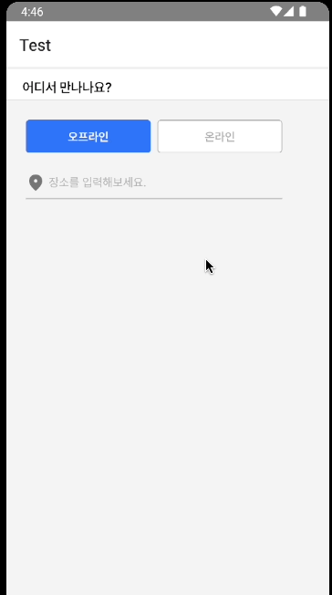

## 문제

<p align="center"></p>

Android에서 TextInput을 눌렀을 때 키보드가 올라오면서 모달까지 위로 올라가는 문제가 발생했다. 모달을 고정시키는 방법을 알아보자.

## 해결

아래 링크에 나온 이슈를 통해 해결할 수 있었다.

https://github.com/react-native-modal/react-native-modal/issues/344#issuecomment-1061127501

React Native Modal의 옵션 중 Android에만 해당하는 `statusBarTranslucent`를 `true`로 설정해주어 해결해준다. 해당 설정은 모달이 system statusbar 아래에 위치해야 하는지 설정하는 옵션이다.

참고: https://reactnative.dev/docs/modal#statusbartranslucent-android

## 결과

```typescript
<Modal
  isVisible={isVisible}
  backdropColor={light.dim}
  style={{ margin: 0 }}
  statusBarTranslucent={true}
>{...}</Modal>
```

설정을 추가하여 문제를 해결했다.
