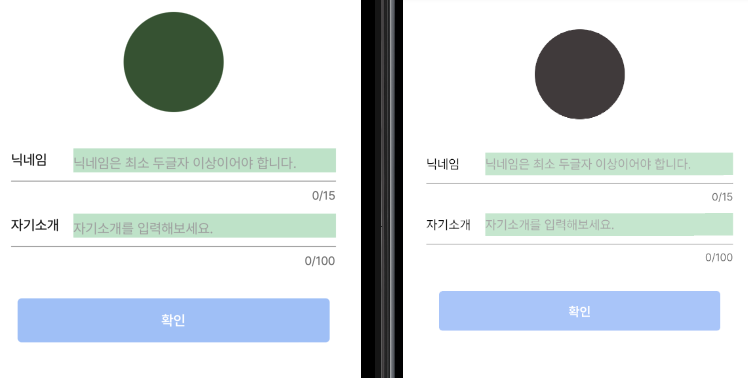
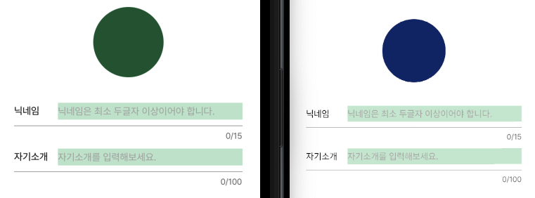

## 문제

`TextInput`을 사용하여 input을 생성했는데 Android는 수직중앙정렬이 잘되었지만 iOS에서는 정렬이 잘되지 않는 문제를 발견했다.

<p align="center"></p>

왼쪽이 iOS, 오른쪽이 Android고 iOS의 수직정렬이 중앙이 아닌 것을 알 수 있다.

## 해결

문제해결을 위해 처음부터 다시 스타일링을 적용해봤고 문제가 `line-height` 설정 이후부터 발생한다는 것을 알아냈다.

아래 링크를 확인해보니 iOS에서 `TextInput`에 `line-height`를 설정했을 때 텍스트가 올바르게 정렬되지 않고 텍스트가 잘리는 등의 문제가 생긴다고 한다.

https://github.com/facebook/react-native/issues/28012

폰트 설정을 할 때 `line-height`가 설정되어 있던게 문제였고 설정을 다시 추가했다.

```typescript
// Platform import
import { Platform } from 'react-native';

// TextInput Component
<StInput
  placeholder={placeholder}
  maxLength={maxLength}
  value={value}
  onChangeText={onChangeText}
/>;

// TextInput Styling
const StInput = styled.TextInput.attrs({
  placeholderTextColor: light.contents.contentThird,
})`
  flex: 1;
  padding: 0;
  ${paragraph.Small};
  line-height: ${Platform.OS === 'ios' ? 0 : paragraph.Small.lineHeight};
`;
```

`Platform.OS`가 `ios`라면 `line-height: 0`을, `android`라면 기존 설정이 적용되도록 했다.

## 결과

<p align="center"></p>

iOS와 Android 모두 수직중앙정렬이 되어있는 것을 확인할 수 있다.
