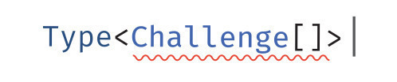

<p align="center"></p>

## 문제

https://github.com/type-challenges/type-challenges/blob/main/questions/00108-medium-trim/README.md

<br/>

정확한 문자열 타입이고 양쪽 끝의 공백이 제거된 새 문자열을 반환하는 Trim<T>를 구현하십시오.
예시:

```typescript
type trimmed = Trim<'  Hello World  '>; // 기대되는 결과는 'Hello World'입니다.
```

<br/>

## 내 답안

```typescript
type Space = ' ' | '\n' | '\t';
type Trim<S extends string> = S extends
  | `${infer A}${Space}`
  | `${Space}${infer A}`
  ? Trim<A>
  : S;
```
